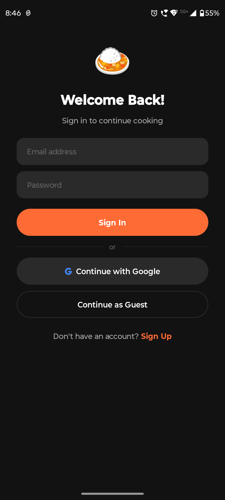
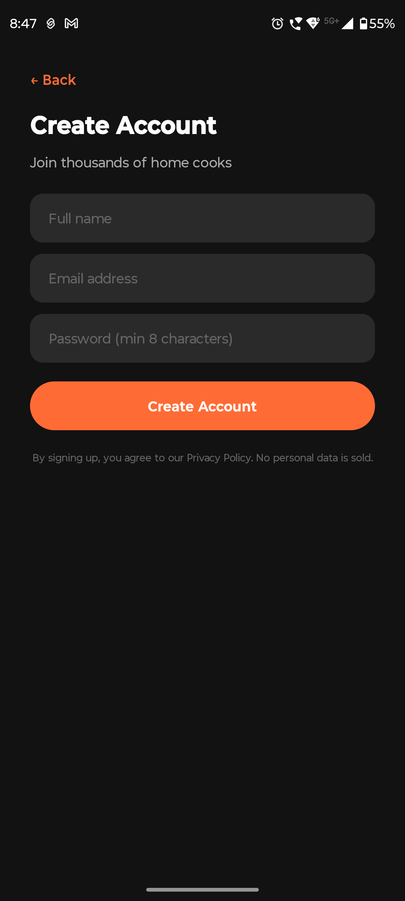
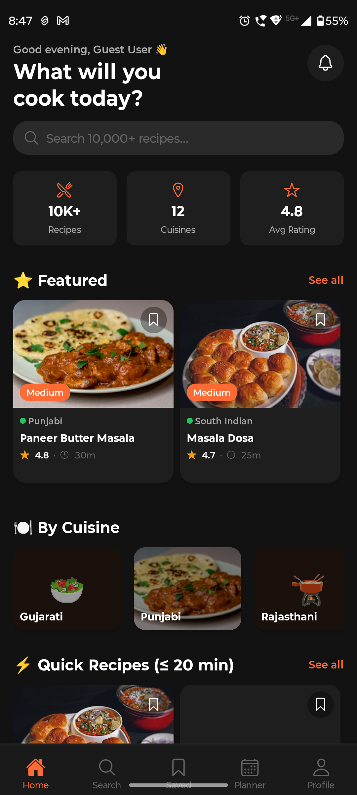
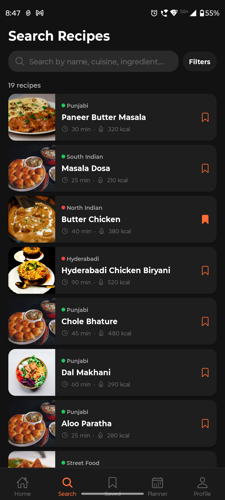
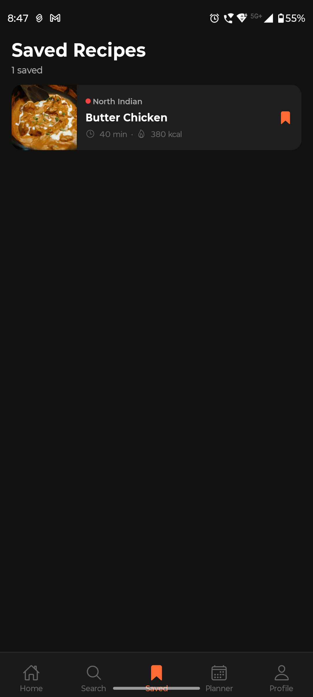
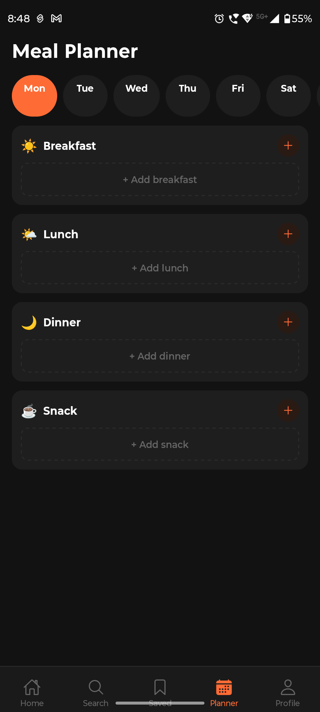
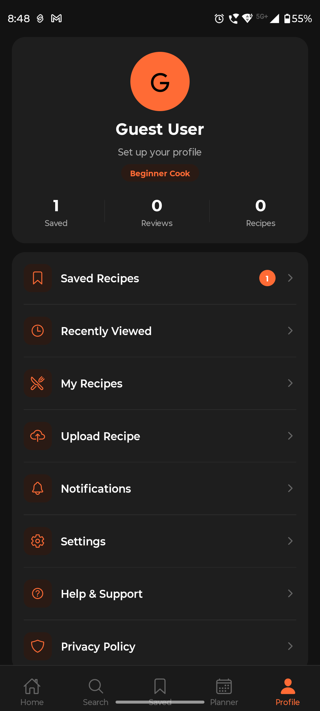
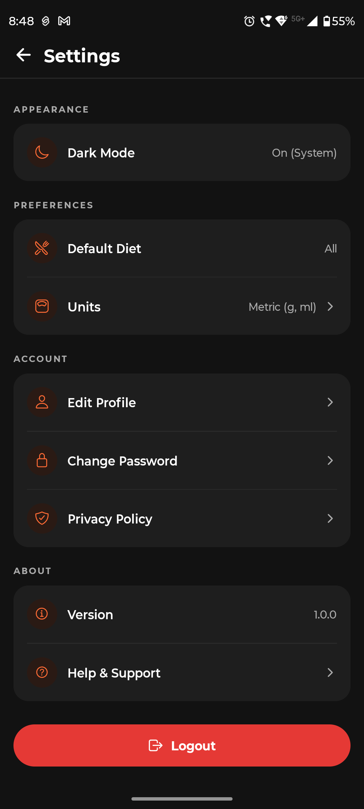

# 🍛 MealMitra

**MealMitra** is a modern, offline-first Indian recipe app built with React Native & Expo. It helps users discover recipes, cook with step-by-step guidance, plan weekly meals, manage grocery lists, and get AI-powered cooking help — all for free, with no ads and no subscriptions.

---

## 📱 Screenshots

| Login | Sign Up | Home |
|-------|---------|------|
|  |  |  |

| Search | Saved Recipes | Meal Planner |
|--------|---------------|--------------|
|  |  |  |

| Profile | Settings |
|---------|----------|
|  |  |

---

## ✨ Features

### 🔍 Recipe Discovery
- Browse **10,000+ Indian recipes** across 12+ cuisines
- Full-text search by name, cuisine, or ingredient (powered by **Fuse.js**)
- Filter by diet type, difficulty, cook time, and cuisine
- Featured recipes and quick recipes (≤ 20 min) sections on home screen
- Browse **By Cuisine** (Gujarati, Punjabi, Rajasthani, Bengali, South Indian, and more)

### 🍳 Cooking Mode
- Interactive step-by-step cooking interface
- Per-step timers
- Ingredient scaling by number of servings

### 📊 Nutrition Information
- Per-serving macros: protein, carbs, fat, fiber, sugar
- Calorie count displayed on every recipe card

### 🤖 AI Cooking Assistant
- Ask cooking questions
- Get ingredient substitution suggestions
- Powered by an open-source LLM API

### 📅 Meal Planner
- Plan meals for the entire week (Mon–Sun)
- Separate slots for Breakfast, Lunch, Dinner, and Snack
- Add recipes directly from any recipe detail page

### 🛒 Grocery List
- Auto-generated shopping list from your meal plan
- Manage and check off items as you shop

### 🔖 Saved Recipes
- Bookmark any recipe with one tap
- View all saved recipes in a dedicated tab
- Save count shown on your profile

### 👤 User Profiles
- Guest mode — use the full app without an account
- Sign up / Sign in with email & password
- Continue with Google (OAuth)
- Profile stats: Saved, Reviews, Recipes uploaded
- Skill badge (e.g., "Beginner Cook")

### ⚙️ Settings
- **Dark Mode** — Auto (System), Light, or Dark
- **Default Diet** filter — All, Vegetarian, Vegan, Non-Vegetarian, Eggetarian
- **Units** — Metric (g, ml) or Imperial
- Edit Profile & Change Password
- Privacy Policy & Help & Support

---

## 🏗️ Tech Stack

| Layer | Technology |
|---|---|
| Framework | [React Native](https://reactnative.dev/) + [Expo](https://expo.dev/) ~54 |
| Language | TypeScript |
| Navigation | [Expo Router](https://expo.github.io/router/) (file-based routing) |
| State Management | [Zustand](https://zustand-demo.pmnd.rs/) |
| Backend / Auth | [Supabase](https://supabase.com/) (auth, storage) |
| Local Storage | AsyncStorage |
| Search | [Fuse.js](https://fusejs.io/) (fuzzy full-text search) |
| Animations | [React Native Reanimated](https://docs.swmansion.com/react-native-reanimated/) |
| Icons | [@expo/vector-icons](https://docs.expo.dev/guides/icons/) |
| Auth OAuth | [expo-auth-session](https://docs.expo.dev/versions/latest/sdk/auth-session/) |

---

## 📁 Project Structure

```
MealMitraApp/
├── app/                        # Expo Router screens
│   ├── (onboarding)/           # Auth flow: slides, login, signup, profile setup
│   ├── (tabs)/                 # Main tab screens: home, search, saved, planner, profile
│   ├── category/[name].tsx     # Category detail screen
│   ├── recipe/[id].tsx         # Recipe detail screen
│   │   └── cooking/[id].tsx    # Cooking mode screen
│   ├── add-to-planner.tsx
│   ├── ai-assistant.tsx
│   ├── grocery.tsx
│   ├── my-recipes.tsx
│   ├── notifications.tsx
│   ├── privacy.tsx
│   ├── recently-viewed.tsx
│   ├── settings.tsx
│   └── upload-recipe.tsx
├── src/
│   ├── components/             # Reusable UI components
│   │   ├── ConfirmModal.tsx
│   │   ├── CuisineCard.tsx
│   │   ├── FilterChip.tsx
│   │   ├── Header.tsx
│   │   ├── NutritionBadge.tsx
│   │   ├── RecipeCard.tsx
│   │   ├── SearchBar.tsx
│   │   └── Toast.tsx
│   ├── data/
│   │   └── recipes.ts          # Local recipe database
│   ├── hooks/
│   │   └── useToast.ts
│   ├── services/
│   │   ├── searchService.ts    # Fuse.js search index
│   │   └── supabase.ts         # Supabase client
│   ├── store/                  # Zustand state stores
│   │   ├── groceryStore.ts
│   │   ├── plannerStore.ts
│   │   ├── recipeStore.ts
│   │   ├── savedStore.ts
│   │   └── userStore.ts
│   ├── theme/
│   │   ├── index.ts            # Color tokens (light & dark)
│   │   └── useTheme.ts
│   └── types/
│       └── index.ts            # TypeScript interfaces
├── assets/
│   └── images/
├── android/                    # Android native project
├── app.json                    # Expo app config
├── package.json
└── tsconfig.json
```

---

## 🍽️ Supported Cuisines

- Gujarati
- Punjabi
- Rajasthani
- Bengali
- Maharashtrian
- South Indian
- North Indian
- Hyderabadi
- Street Food
- Desserts
- Indo-Chinese
- and more…

---

## 🚀 Getting Started

### Prerequisites

- [Node.js](https://nodejs.org/) (v18+)
- [Expo CLI](https://docs.expo.dev/get-started/installation/) — `npm install -g expo-cli`
- [Android Studio](https://developer.android.com/studio) (for Android emulator) or a physical device with Expo Go

### 1. Clone the repository

```bash
git clone https://github.com/your-username/MealMitraApp.git
cd MealMitraApp
```

### 2. Install dependencies

```bash
npm install
```

### 3. Configure environment variables

Copy the example env file and fill in your Supabase credentials:

```bash
cp .env.example .env
```

```env
EXPO_PUBLIC_SUPABASE_URL=your_supabase_project_url
EXPO_PUBLIC_SUPABASE_ANON_KEY=your_supabase_anon_key
```

### 4. Start the development server

```bash
npx expo start --clear
```

Then press `a` to open on Android emulator, `i` for iOS simulator, or scan the QR code with **Expo Go** on your physical device.

### 5. Build a release APK (Android)

```bash
cd android
./gradlew assembleRelease
```

The APK will be at `android/app/build/outputs/apk/release/app-release.apk`.

---

## 🔐 Authentication

MealMitra supports three sign-in methods:

| Method | Description |
|--------|-------------|
| Email & Password | Classic sign up / sign in via Supabase Auth |
| Google OAuth | One-tap sign in using `expo-auth-session` |
| Guest Mode | Use the full app without any account |

---

## 🗂️ Data Model

```typescript
interface Recipe {
  id: string;
  name: string;
  cuisine: string;
  diet: 'Vegetarian' | 'Non-Vegetarian' | 'Vegan' | 'Eggetarian';
  difficulty: 'Easy' | 'Medium' | 'Hard';
  cook_time: number;       // minutes
  prep_time: number;       // minutes
  servings: number;
  calories: number;
  rating: number;
  reviews: number;
  image: string;
  description: string;
  ingredients: Ingredient[];
  preparation: PreparationStep[];
  nutrition: Nutrition;    // protein, carbs, fat, fiber, sugar
  equipment: string[];
  steps: CookingStep[];    // step number, instruction, time
  tips: string[];
  tags: string[];
}
```

---

## 🎨 Design System

| Token | Value |
|-------|-------|
| Primary Accent | `#FF6B35` (orange) |
| Dark Background | `#111111` |
| Light Background | `#FFFFFF` |
| Surface (dark) | `#1E1E1E` |
| Text Primary | `#FFFFFF` / `#111111` |
| Success | `#22C55E` |
| Error | `#EF4444` |
| Warning / Stars | `#F59E0B` |

The app follows the system theme preference and supports **automatic dark/light mode switching**.

---

## 🛠️ Available Scripts

| Command | Description |
|---------|-------------|
| `npm start` | Start Expo dev server |
| `npm run android` | Run on Android device/emulator |
| `npm run ios` | Run on iOS simulator |
| `npm run web` | Run in web browser |

---

## 📦 Key Dependencies

| Package | Version | Purpose |
|---------|---------|---------|
| `expo` | ~54.0.0 | Core framework |
| `expo-router` | ~6.0.23 | File-based navigation |
| `@supabase/supabase-js` | ^2.98.0 | Auth & backend |
| `zustand` | ^5.0.11 | State management |
| `fuse.js` | ^7.1.0 | Fuzzy search |
| `react-native-reanimated` | ~4.1.1 | Animations |
| `expo-auth-session` | ~7.0.10 | Google OAuth |
| `expo-sqlite` | ~16.0.10 | Local database |

---

## 🗺️ Roadmap

- [ ] Upload custom recipes
- [ ] AI-generated meal plans
- [ ] Push notifications for meal reminders
- [ ] Recipe ratings & reviews
- [ ] Social sharing
- [ ] iOS release
- [ ] Expand to 50,000+ recipes

---

## 🤝 Contributing

Contributions are welcome! Please open an issue first to discuss what you'd like to change.

1. Fork the repository
2. Create your feature branch: `git checkout -b feature/amazing-feature`
3. Commit your changes: `git commit -m 'Add amazing feature'`
4. Push to the branch: `git push origin feature/amazing-feature`
5. Open a Pull Request

---

## 📄 License

This project is private. All rights reserved.

---

## 👨‍💻 Author

Built with ❤️ for home cooks everywhere.

> *"MealMitra — Your kitchen companion."*
